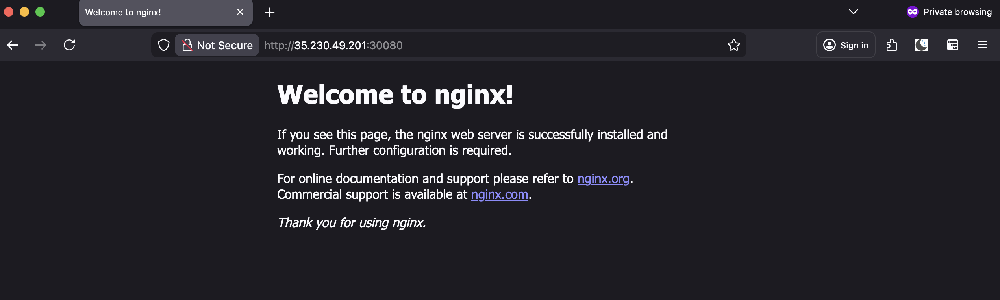
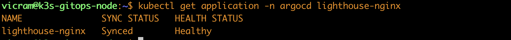

# GCP GitOps Lighthouse ⚓️

A production-ready GitOps pipeline demonstrating Infrastructure-as-Code (IaC) and Continuous Delivery on Google Cloud Platform.

## 2. System Architecture
This project implements a "Push-button" infrastructure and application lifecycle:
1. **Infrastructure**: Provisioned via **Terraform** (Compute Engine, VPC, Firewalls).
2. **Orchestration**: **K3s** (Lightweight Kubernetes) for container management.
3. **Continuous Delivery**: **ArgoCD Core** monitors a GitHub repository for declarative state.
4. **Application**: Scalable Nginx deployment exposed via NodePort.

## 3. Tech Stack
- **Cloud**: Google Cloud Platform (GCP)
- **IaC**: Terraform
- **Kubernetes**: K3s
- **GitOps**: ArgoCD Core
- **Configuration**: YAML / HCL

## 4. Key Achievements & Proof of Work
- **Automated Scaling**: Demonstrated GitOps by scaling from 1 to 3 replicas via Git commit, with ArgoCD reconciling the state in <60 seconds.
- **Resource Optimization**: Successfully migrated from `f1-micro` to `e2-medium` to resolve TLS handshake and memory thrashing issues.
- **Security**: Implemented Least Privilege firewall rules, specifically exposing port `30080` for application traffic.

## 5. How to View
The application is currently live at:
`http://<EXTERNAL_IP>:30080`

## Proof of Deployment

### 1. Application Accessibility
The Nginx web server is successfully exposed via a GCP Firewall rule and Kubernetes NodePort, reachable at the VM's public IP.

### 2. GitOps Reconciliation
ArgoCD Core successfully synchronized the desired state from GitHub. Note the `Synced` and `Healthy` status.

### 3. Declarative Scaling
By updating the `replicas` count in GitHub, the cluster automatically scaled to 3 pods without manual intervention.
